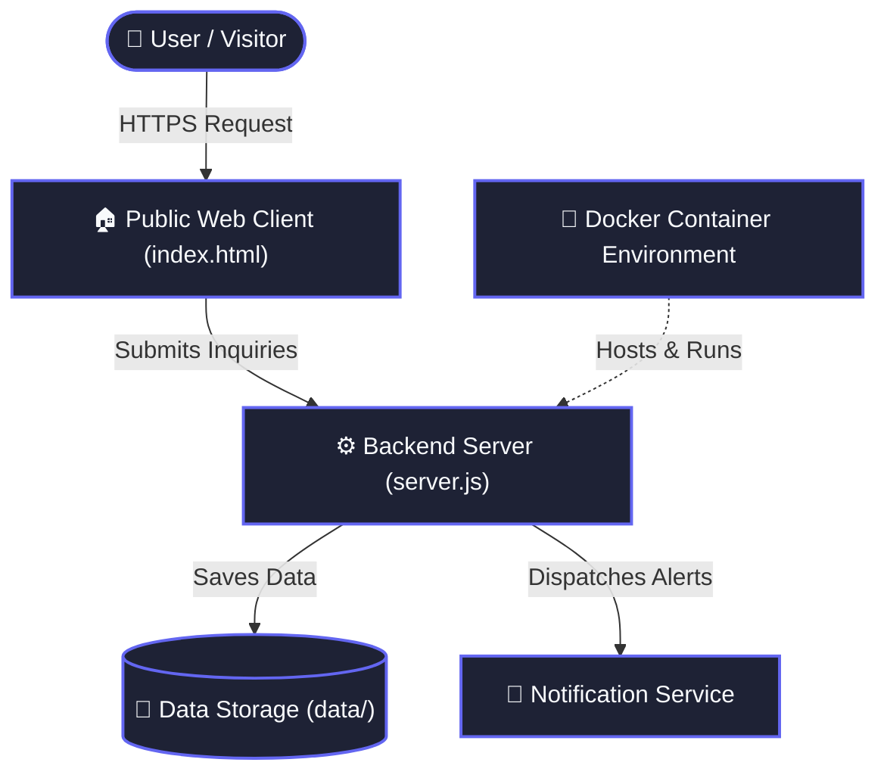

<div align="center">

# LostinTranslation

**loss of cultural and semantic context**

[](https://github.com/Mohito-s/LostinTranslation/stargazers)
[](LICENSE)
[](https://github.com/Mohito-s/LostinTranslation/issues)
[](https://github.com/Mohito-s/LostinTranslation/pulls)

<p align="center">
  [Report Bug](https://github.com/Mohito-s/LostinTranslation/issues) • [Request Feature](https://github.com/Mohito-s/LostinTranslation/issues)
</p>

</div>

---

## 📖 Overview

loss of cultural and semantic context

---

## ✨ Features

| Feature | Description |
| :--- | :--- |
| ⚡ **Responsive & Fast UI** | Fluid layout optimized for instantaneous load times across mobile, tablet, and desktop. |
| 🗄️ **Type-Safe Data Persistence** | Structured database schemas with automated migrations and efficient query execution. |
| 🐳 **Containerized Deployment** | Pre-configured Docker environment enabling repeatable production deployments and isolated development. |

---

## 🛠 Tech Stack

       

---

## 🏛 Architecture



---

## 🚀 Quick Start

### Prerequisites
Make sure you have [npm](https://www.google.com/search?q=npm) installed on your machine.

### Installation

```bash
# 1. Clone the repository
git clone https://github.com/Mohito-s/LostinTranslation.git

# 2. Enter repository directory
cd LostinTranslation

# 3. Install project dependencies
npm install

# 4. Start local development server
npm run dev
```

---

## 📋 Changelog

### v1.0.0 (2026-10-05)
- pricing: drop Pro tier from \ to "
- style: swap accent to neon lime (Supabase/terminal vibe)
- style: developer-first redesign (Stripe/Supabase dark)
- Cultural QA compare endpoint with severity scoring
- add opencode skills and MCP (github, playwright) config
- structured logging, configurable AI model/CORS, supertest coverage

---

## 🤝 Contributing

Contributions, issues and feature requests are welcome!  
Feel free to check [issues page](https://github.com/Mohito-s/LostinTranslation/issues).

1. Fork the Project
2. Create your Feature Branch (`git checkout -b feature/AmazingFeature`)
3. Commit your Changes (`git commit -m 'Add some AmazingFeature'`)
4. Push to the Branch (`git push origin feature/AmazingFeature`)
5. Open a Pull Request

---

## 📝 License

Distributed under the **AGPL-3.0 License**. See `LICENSE` for more information.

<div align="center">
  <sub>Built with ❤️ using <a href="https://github.com/Mohito-s/RepoHero">RepoHero</a> • Powered by Google Gemini 3.8</sub>
</div>
