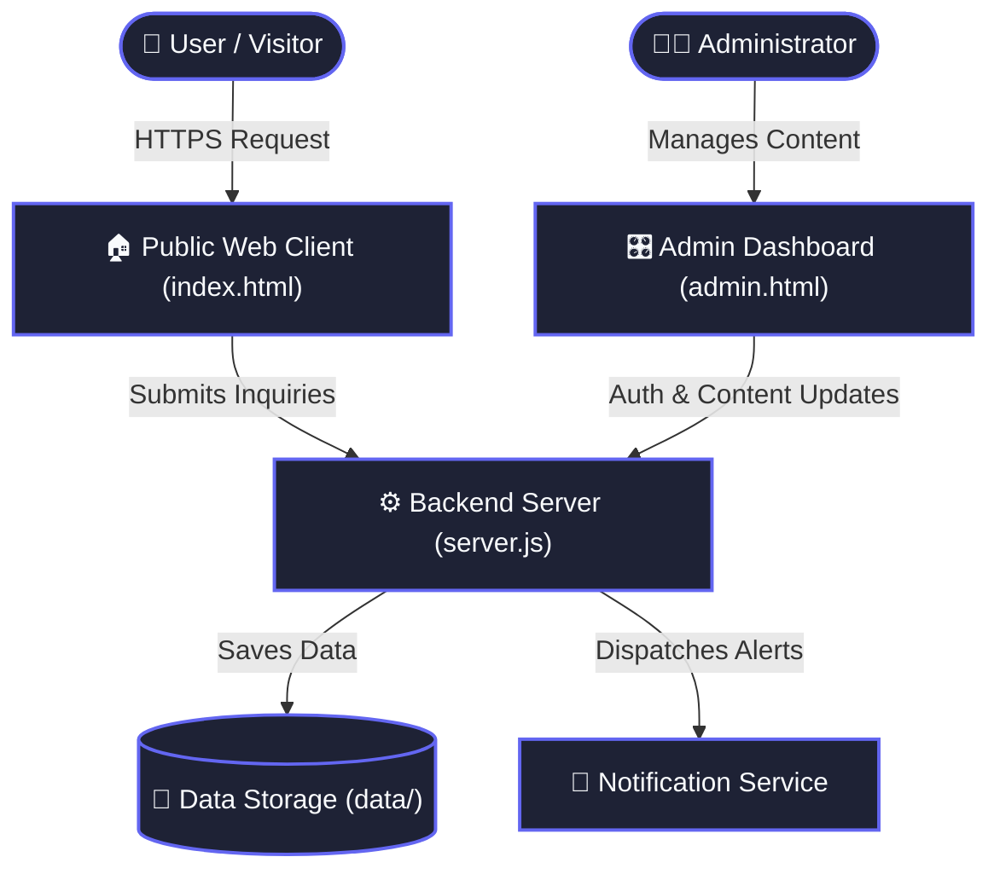

<div align="center">

# stroikakras.ru

**Professional Craftsman & Tiling Landing Platform with Live Admin & Lead Hub**

[](https://github.com/Mohito-s/stroikakras.ru/stargazers)
[](LICENSE)
[](https://github.com/Mohito-s/stroikakras.ru/issues)
[](https://github.com/Mohito-s/stroikakras.ru/pulls)

<p align="center">
  [Report Bug](https://github.com/Mohito-s/stroikakras.ru/issues) • [Request Feature](https://github.com/Mohito-s/stroikakras.ru/issues)
</p>

</div>

---

## 📖 Overview

**stroikakras.ru** — автономный веб-сайт мастера по укладке плитки и отделочным работам со встроенной административной панелью, интерактивным до/после слайдером, галереей портфолио и надежной обработкой входящих заявок.

---

## ✨ Features

| Feature | Description |
| :--- | :--- |
| 🔄 **Interactive Before/After Slider** | Smooth pointer-captured image comparison widget displaying high-resolution craftsmanship results. |
| 🎛️ **Integrated Admin Panel** | Built-in management interface for live content updates, portfolio photos, and schedule moderation. |
| 📬 **Automated Lead Notification Hub** | Instant customer lead capture with local JSON data persistence and automated email dispatching. |
| 📱 **PWA & Mobile-First Experience** | Progressive Web App support with custom icons, responsive hardware-accelerated dock, and offline readiness. |
| 🔍 **Search Engine Optimization (SEO)** | Pre-configured sitemap, robots directives, and semantic micro-markup tailored for high search visibility. |

---

## 🛠 Tech Stack

   

---

## 🏛 Architecture



---

## 🚀 Quick Start

### Prerequisites
Make sure you have [npm](https://www.google.com/search?q=npm) installed on your machine.

### Installation

```bash
# 1. Clone the repository
git clone https://github.com/Mohito-s/stroikakras.ru.git

# 2. Enter repository directory
cd stroikakras.ru

# 3. Install project dependencies
# No dependencies required

# 4. Start local development server
npx serve .
```

---

## 📋 Changelog

### v1.0.0 (2026-10-05)
- Обновил ридми
- Delete all content from README.md
- Обновил ридми
- switch lead notifications and public contact email to brother's email Pisbmaestb@mail.ru
- integrate autonomous postfix email notification for incoming leads
- set master email to ot4izna@list.ru and wire up server-side lead persistence

---

## 🤝 Contributing

Contributions, issues and feature requests are welcome!  
Feel free to check [issues page](https://github.com/Mohito-s/stroikakras.ru/issues).

1. Fork the Project
2. Create your Feature Branch (`git checkout -b feature/AmazingFeature`)
3. Commit your Changes (`git commit -m 'Add some AmazingFeature'`)
4. Push to the Branch (`git push origin feature/AmazingFeature`)
5. Open a Pull Request

---

## 📝 License

Distributed under the **MIT License**. See `LICENSE` for more information.

<div align="center">
  <sub>Built with ❤️ using <a href="https://github.com/Mohito-s/RepoHero">RepoHero</a> • Powered by Google Gemini 3.8</sub>
</div>
